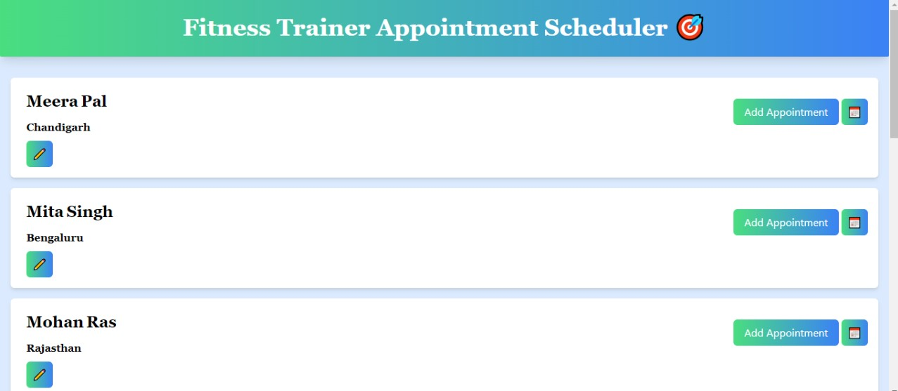
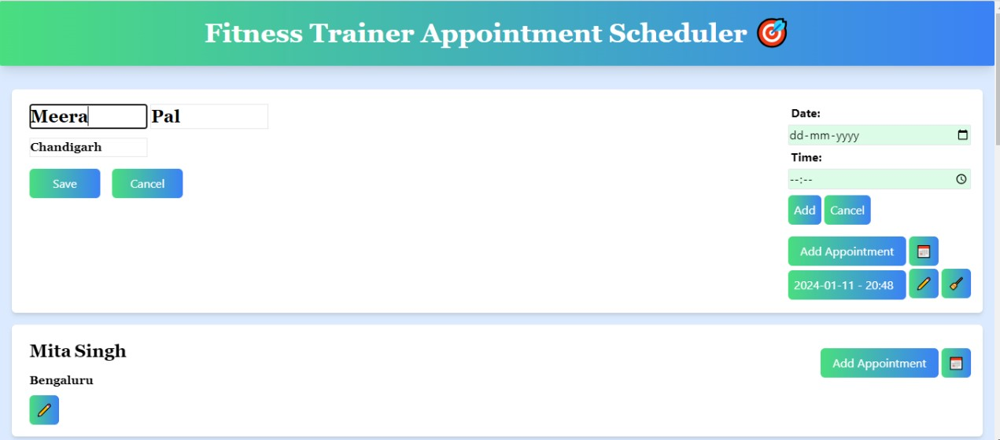
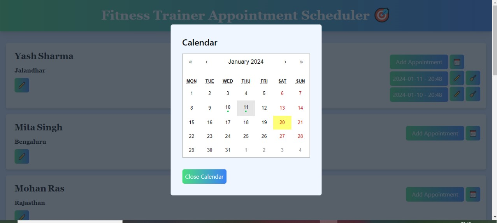

# Welcome to my Fitness Trainer Appointment Scheduler
### A web application that allows a fitness trainer to manage client appointments efficiently. The web app provides a user-friendly interface for the trainer to add, edit, and delete appointments and client details. Implemented a calendar view page for fitness trainers to see every client's appointments.

## Features
1) Grid layout where each row corresponds to a different client.
2) Edit the client's first name, last name, and location.
3) Save and Cancel client details.
4) Add appointments (single or multiple), edit and delete both time and date.
5) Calendar for each client's appointments which shows all appointments with the green dot.
6) Aesthetically pleasing UI, user-friendly, and fully responsive.
6) Informative error messages like all fields required and notifications for successful actions for appointments edited, or deleted.

## How it looks 

 

## Tech Stack
1) HTML
2) CSS
3) JavaScript
4) Parcel
5) React JS
6) Tailwind CSS

## How to run
1) Download the Zip folder of the provided "schedule_appointment" repository.
2) Open VS Code & then open terminal (ctrl+shift+`)
3) run "npm i" (It will install all the necessary packages that are mentioned in the package.json
4) run "npm start" or "npm run start" (To start the website)
6) The website will be live at localhost, just copy the URL and run it on the browser.
7) Congrats, you will be able to use the website's functionalities on localhost.

Happy Coding!❤
